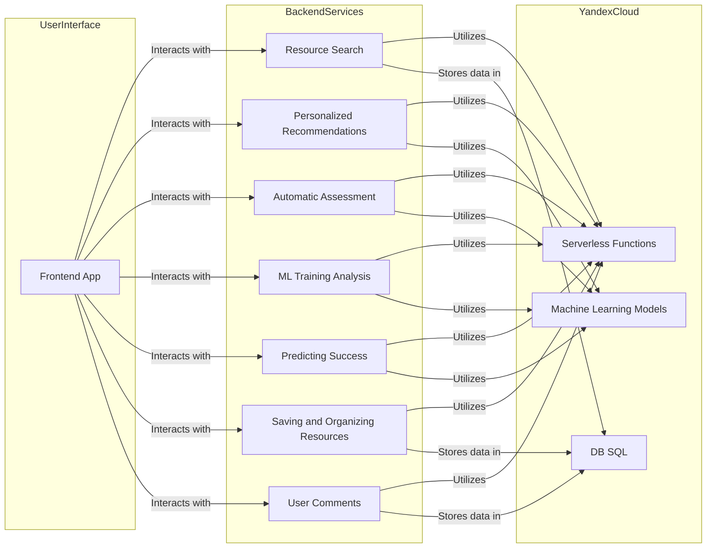
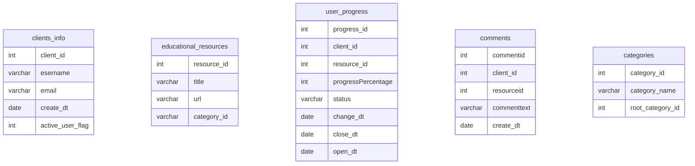

# SelfLearn
The application for finding resources for self-study.

# Architecture

```mermaid
graph LR    
    
    subgraph UserInterface
        A[Frontend App]
    end

    subgraph BackendServices
        B[Resource Search]
        C[Personalized Recommendations]
        D[Automatic Assessment]
        E[ML Training Analysis]
        F[Predicting Success]
        G[Saving and Organizing Resources]
        H[User Comments]
    end

    subgraph YandexCloud
        I[Serverless Functions]
        J[DB SQL]
        K[Machine Learning Models]
    end

    A -->|Interacts with| B
    A -->|Interacts with| C
    A -->|Interacts with| D
    A -->|Interacts with| E
    A -->|Interacts with| F
    A -->|Interacts with| G
    A -->|Interacts with| H

    B -->|Utilizes| I
    C -->|Utilizes| I
    D -->|Utilizes| I
    E -->|Utilizes| I
    F -->|Utilizes| I
    G -->|Utilizes| I
    H -->|Utilizes| I

    B -->|Stores data in| J
    G -->|Stores data in| J
    H -->|Stores data in| J

    C -->|Utilizes| K
    D -->|Utilizes| K
    E -->|Utilizes| K
    F -->|Utilizes| K
```

## Database Tables

```mermaid
erDiagram
    clients_info {
        int client_id
        varchar esername
        varchar email
        date create_dt
        int active_user_flag
    }
    educational_resources {
        int resource_id
        varchar title
        varchar url
        varchar category_id
    }
    user_progress {
        int progress_id
        int client_id
        int resource_id
        int progressPercentage
        varchar status
        date change_dt
        date close_dt
        date open_dt
    }
    comments {
        int commentid
        int client_id
        int resourceid
        varchar commenttext
        date create_dt
    }
    categories {
        int category_id
        varchar category_name
        int root_category_id
    }
```